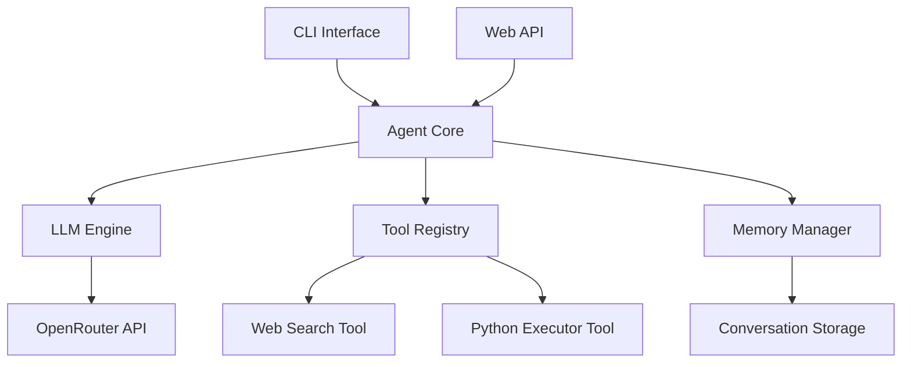

# AgentWorkbench


An advanced AI agent system that combines language models with tool execution capabilities, featuring a conversational CLI interface and web API.

## About

AgentPlayGround is a comprehensive AI agent framework designed to demonstrate the integration of large language models with practical tool execution capabilities. The project serves as both a functional AI assistant and an educational example of how to build sophisticated agent systems.

### Key Differentiators

- **Unified Interface**: Both CLI and Web API provide seamless access to the same agent capabilities
- **Extensible Tool System**: Easy to add new tools for various domains and use cases
- **Persistent Memory**: Conversations are saved and can be resumed with context
- **Production-Ready**: Built with FastAPI, rich logging, and comprehensive error handling
- **OpenRouter Integration**: Access to multiple LLM providers through a single interface

### Use Cases

- **Development**: Test and prototype AI agent workflows
- **Research**: Experiment with different prompting strategies and tool combinations
- **Education**: Learn about agent architecture and LLM integration patterns
- **Automation**: Build automated assistants for specific tasks
- **Integration**: Embed AI capabilities into existing applications

## Features

- **AI Assistant CLI**: Interactive command-line interface for AI conversations
- **Web API**: RESTful API using FastAPI for programmatic access
- **Tool System**: Extensible tool framework including web search and Python execution
- **Memory Management**: Persistent conversation memory with context tracking
- **LLM Integration**: OpenRouter API support for multiple language models
- **Stream Processing**: Real-time streaming responses for better UX
- **Structured Logging**: Rich logging with colored output and structured logs

## Architecture



The system follows a modular architecture with clear separation of concerns:

- **CLI Layer**: User interaction through command-line interface
- **Agent Layer**: Core agent logic and tool orchestration
- **LLM Layer**: Language model integration and prompt management
- **Tool Layer**: Extensible tool framework for external capabilities
- **Memory Layer**: Conversation persistence and context management
- **API Layer**: Web service endpoints for programmatic access

## Installation

### Prerequisites

- Python 3.14 or higher
- pip or uv package manager

### Installation Steps

```bash
# Clone the repository
https://github.com/yourusername/agent-playground.git

# Navigate to project directory
cd agent-playground

# Install dependencies using pip
pip install -r requirements.txt

# Or using uv (recommended)
uv sync

# Install the package in development mode
pip install -e .
```

### Quick Start

```bash
# Start the CLI assistant
code-pilot

# Start the web API
server.py

# Or run both using uvicorn
uvicorn server:app --reload
```

## Quick Start

### Using CLI

```bash
# Launch the AI assistant
code-pilot

# Interactive session features:
/exit - Exit the assistant
/clear - Clear conversation history
```

### Using Web API

```bash
# Start the FastAPI server
uvicorn server:app --reload

# Test the API endpoints
curl "http://localhost:8000/api/llm/ask?user_input=Hello"
```

### Example CLI Session

```
[cyan]AI Assistant ready — /exit to quit, /clear to reset[/cyan]

[bold red]You:[/bold red]
      What is the capital of France?

[blue]⠋ Thinking...[/blue]

[bold green]Assistant:[/bold green]
The capital of France is Paris. It's known for its art, fashion, and culture.
```

## Project Structure

```
/agent-playground/
├── src/
│   ├── cli.py              # Command-line interface
│   ├── server.py           # FastAPI web server
│   ├── agent/              # Agent core system
│   │   ├── agent.py        # Main agent class
│   │   ├── api.py          # Agent API endpoints
│   │   └── tools/          # Tool framework
│   │       ├── base.py     # Base tool class
│   │       ├── python_executor.py  # Python execution tool
│   │       └── web_search.py      # Web search tool
│   ├── core/               # Core utilities
│   │   ├── config.py       # Configuration management
│   │   └── logger.py       # Logging system
│   ├── llm/                # LLM integration
│   │   ├── api.py          # LLM API endpoints
│   │   ├── chat_engine.py  # Chat engine
│   │   ├── openrouter.py   # OpenRouter integration
│   │   ├── parser.py       # Response parsing
│   │   └── prompt.py       # Prompt templates
│   └── memory/             # Memory system
│       ├── json_memory.py  # JSON-based memory storage
│       └── memory_manager.py  # Memory management
├── tests/                  # Test suite
│   ├── test_agent.py       # Agent tests
│   ├── test_memory.py      # Memory tests
│   ├── test_parser.py      # Parser tests
│   └── test_tools.py       # Tool tests
├── pyproject.toml          # Project configuration
├── README.md               # This file
└── requirements.txt        # Dependencies (generated)
```

## Tool System

The tool system provides extensible capabilities for the agent to interact with external services:

### Available Tools

1. **Web Search Tool**
   - Searches the web for information
   - Returns structured results with titles, snippets, and URLs
   - Used for research and fact-checking

2. **Python Executor Tool**
   - Executes Python code safely
   - Captures output and errors
   - Used for computational tasks and data analysis

### Tool Architecture

```python
class BaseTool:
    def __init__(self, name: str, description: str, schema: dict):
        self.name = name
        self.description = description
        self.schema = schema
    
    async def execute(self, parameters: dict) -> str:
        raise NotImplementedError
```

### Tool Registration

Tools are registered with the agent:

```python
agent = Agent()
agent.register_tool(WebSearchTool())
agent.register_tool(PythonExecutorTool())
```

## Memory System

The memory system provides persistent storage for conversations and context:

### Key Features

- **Conversation Storage**: Persistent conversation history
- **Context Management**: Maintains conversation context across interactions
- **Memory Manager**: Centralized memory operations
- **JSON Backend**: Simple and portable storage format

### Memory Operations

```python
from memory.memory_manager import (
    initialize_conversation,
    get_context,
    append_to_conversation,
)

# Initialize a new conversation
initialize_conversation(conversation_id="conv_123")

# Add user message
append_to_conversation(
    role="user", 
    content="Hello, how are you?", 
    conversation_id="conv_123"
)

# Get conversation context
context = get_context(conversation_id="conv_123")
```

### Memory Files

Memory is stored in the `data/conversations/` directory:

```
/data/conversations/
├── abc/
│   ├── conversation.json  # Conversation history
│   └── memory.json        # Memory context
├── conv1/
│   ├── conversation.json
│   └── memory.json
└── ...
```

## Agent Loop

The agent follows a structured loop to process user requests:

### Agent Workflow

1. **Input Processing**: Receive user input and validate
2. **Conversation Management**: Store input and retrieve context
3. **Tool Selection**: Analyze request and select appropriate tools
4. **LLM Integration**: Generate response using language model
5. **Output Generation**: Format and return response
6. **Memory Update**: Store response for future context

### Key Components

- **Tool Definitions**: JSON schema for available tools
- **System Prompt**: Instructions for agent behavior
- **Message History**: Conversation context for LLM
- **Step Limit**: Maximum number of reasoning steps

### Example Agent Execution

```python
agent = Agent()
response = agent.run(
    user_input="Search for Python best practices",
    conversation_id="conv_123"
)
```

## Running Tests

The project includes a comprehensive test suite:

### Test Commands

```bash
# Run all tests
pytest

# Run specific test module
pytest tests/test_agent.py

# Run tests with verbose output
pytest -v

# Run tests with coverage
pytest --cov=src
```

### Test Categories

- **Agent Tests**: Core agent functionality and tool integration
- **Memory Tests**: Memory system operations and persistence
- **Parser Tests**: Response parsing and formatting
- **Tool Tests**: Individual tool functionality

### Test Structure

Tests use pytest with fixtures for:
- Mock LLM responses
- Test conversation scenarios
- Tool execution testing
- Memory state validation

## License

This project is licensed under the MIT License. See the LICENSE file for details.

---

Made with ❤️ by the AmirHossein Imani
